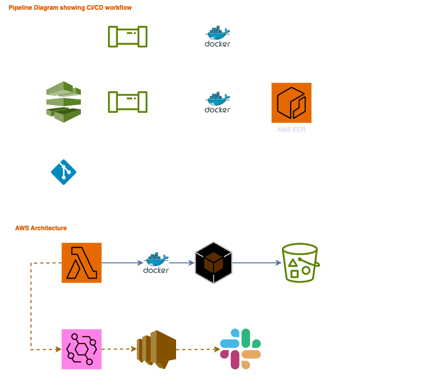

# sure-infra-challenge

This repo contains the logic required to build a mock environment using LocalStack along with a Python script (the main app, located in /src) to query for S3 buckets and remove objects that are older than X number of days.

## Main App

The main app has been written in Python and is located in the /src directory. See README in there for more details.

## Test Environment

A test environment can be spun up using the included bash scripts which will leverage docker and LocalStack to spin up S3 bucket(s) and populate them with objects to run the main app against. The bash scripts can be found in the /scripts dir along with additional info in the README.

## Diagram

Brief diagram showing CI/CD implementation + AWS architecture.

